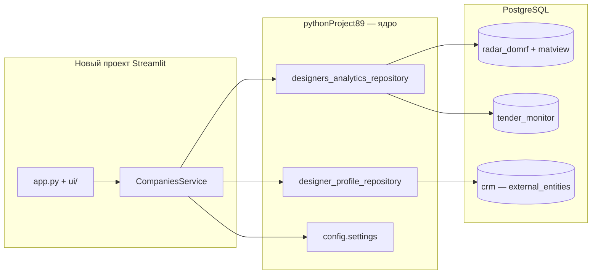

# CRM Компании (Streamlit)


## ??????? ???????

- [2026-07-22 ? CRM / AI / ????????? ???????](docs/WORKLOG_2026-07-22.md)


Лёгкий веб-инструмент для разметки компаний CRM: реестры, категории, классы, избранное.
Профили сохраняются в ту же PostgreSQL-БД `crm`, что и десктопное PyQt-приложение.

## Архитектура



### Откуда данные

| Источник | Что даёт |
|----------|----------|
| **radar_domrf** | Компании NashDom, сегменты объектов, роли |
| **tender_monitor** | Подрядчики из закупок (опционально) |
| **crm** (`crm_external_entities`) | Ручные профили: категория, класс, реестр, сайт, статус, избранное |

Ядро данных и SQL **не дублируются** — импортируются из десктопного проекта через `CRM_SOURCE_ROOT`.

## Быстрый старт

### 1. Установка

```powershell
cd C:\Users\Lenovo\Projects\CRM_Streamlit
pip install -r requirements.txt
```

### 2. Переменные окружения

Скопируйте `.env` из десктопного проекта или заполните вручную по образцу `.env.example`:

```powershell
copy C:\Users\Lenovo\Projects\pythonProject89\.env .env
```

Переменные БД можно задать локально в `.env` или использовать файл из десктопного проекта —
`bootstrap.py` подхватывает `pythonProject89/.env` автоматически (локальные значения имеют приоритет).

Путь к исходнику (`CRM_SOURCE_ROOT`) по умолчанию ищется как соседняя папка `../pythonProject89`.
При необходимости задайте явно в `.env`:

### 3. Запуск

```powershell
streamlit run app.py --server.port 8502
```

Откроется: **http://localhost:8502**

Порт **8502** — чтобы не конфликтовать с генератором ТКП на **8501**.

Или двойной клик по `run.bat`.

## Связь с исходным проектом

Используется **вариант A** — `PYTHONPATH` к `pythonProject89`:

- `src/bootstrap.py` читает `.env` и добавляет `CRM_SOURCE_ROOT` в `sys.path`
- Из исходника импортируются: `config/`, `core/`, `modules/crm/analytics/`
- PyQt-модули **не** используются

Путь к исходнику настраивается в `.env`:

```
CRM_SOURCE_ROOT=C:\Users\Lenovo\Projects\pythonProject89
```

## Структура репозитория

```
CRM_Streamlit/
  app.py                    # точка входа Streamlit
  .streamlit/config.toml    # wide layout, тема #2066B0
  .env.example
  requirements.txt
  run.bat
  src/
    bootstrap.py            # CRM_SOURCE_ROOT → sys.path
    services/
      companies_service.py  # загрузка, merge, сохранение
      db_bootstrap.py       # подключение Radar / Tender / CRM
      filters.py
    ui/
      edit_panel.py         # форма редактирования
      table.py              # DataFrame для таблицы
```

## Экран «Компании»

- **Шапка:** всего компаний, с объектами, объектов NashDom, избранных
- **Sidebar:** обновление данных, фильтры (избранные, поиск, регион, класс)
- **Вкладки:** Проектировщики / Подрядчики / Проектировщик-подрядчик / Другое / ⭐ Избранные
- **Таблица + форма:** выбор строки → редактирование профиля → сохранение в CRM

Сортировка: избранные сверху → класс A→E → больше объектов.

Кнопка «↻ Обновить данные» сбрасывает кэш и при наличии обновляет materialized view `mv_designer_analytics_companies`.

## Проверка без UI

```powershell
python -c "import sys; sys.path.insert(0, '.'); from src.bootstrap import setup_source_path; setup_source_path(); from src.services.db_bootstrap import connect_databases; from src.services.companies_service import CompaniesService; r,t,c,w=connect_databases(); s=CompaniesService(r,t,c); s.load_sync(); print(len(s.all_companies), 'companies')"
```

## Раздел «Заказчики» — карта проектов

Подключается к БД **nspd_parking_parser** (`cadastral_object`, `parking_candidate`, `management_company`).

Меню слева → **Заказчики** → вкладки:
- **Карта проектов** — Leaflet + кластеры, цвет точки по УК (хэш ОГРН), попап с адресом/КН/этажами/УК
- **Управляющие компании** — таблица УК с количеством объектов

Фильтры на вкладке карты: подземные этажи, статус УК, район/адрес, легенда УК (клик подсвечивает объекты).

Переменные БД — `PARKING_DB_*` в `.env` или автоподхват из `../nspd_parking_parser/.env`.

CLI-экспорт GeoJSON (отладка, geojson.io):

```powershell
python scripts/export_map_geojson.py -o data/map_export.geojson --min-floors 2
```

## Дальнейшие фазы (не в MVP)

- Детализация: список объектов компании
- PDF-экспорт
- Массовое редактирование через `st.data_editor`
- Docker / внутренний сервер
